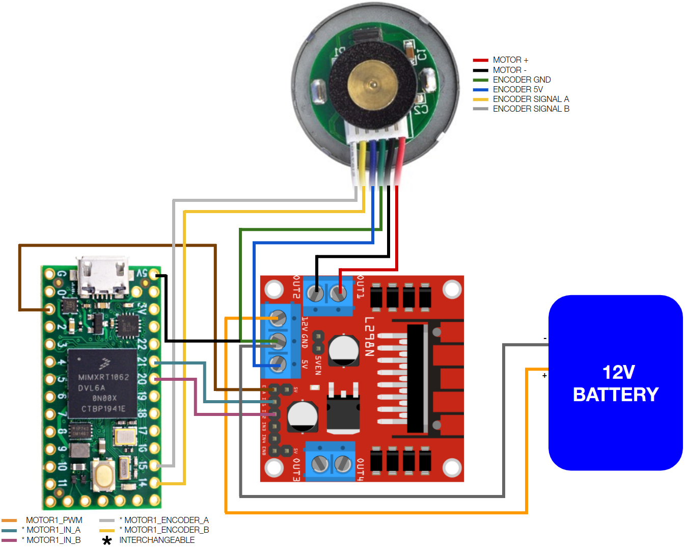
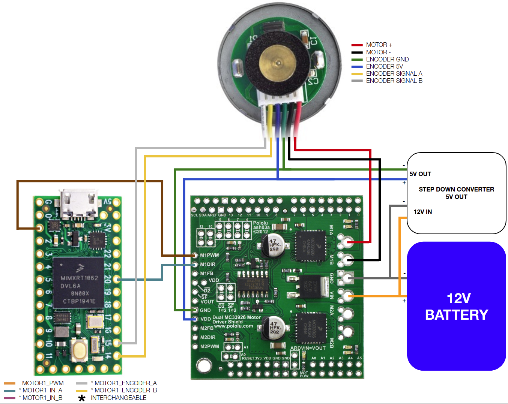
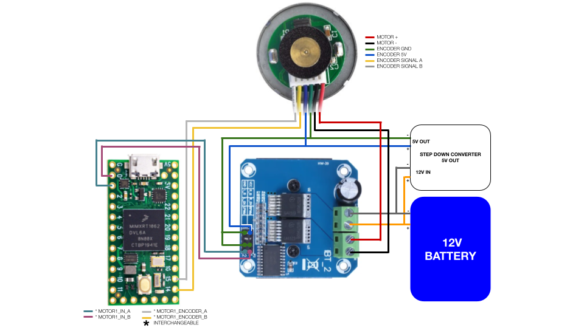
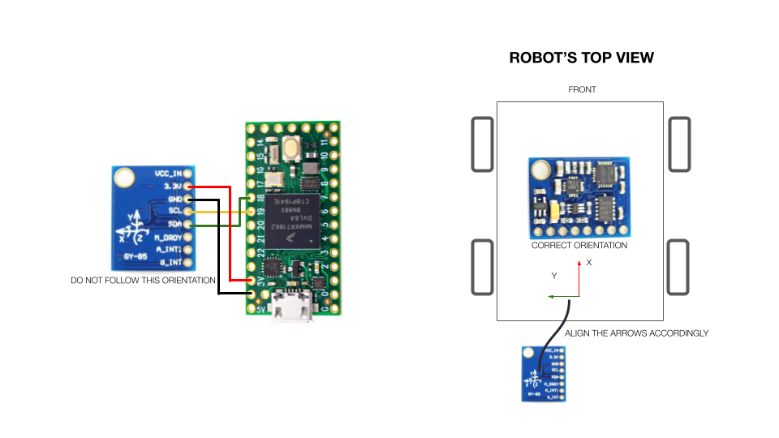

# Humble and Teensy Documentation (Obsolete)

## Humble not supported

Humble is EOL in ROS and consequently EOL in linorobot2_hardware.

### Teensy microcontroller family deprecated

The last versions of the Teensy microcontroller family (4.0 and 4.1) were introduced in 2019 and 2020. The owner, PJRC, has transferred the design to Sparkfun and there will be no more Teensy models. This version of linorobot2_hardware should support the Teensy family of microcontrollers as it used to - support has not been removed - but Teensy is untested on this version and the Teensy family should be considered deprecated. Problems may not be fixed. This version of firmware changes the default baud rate for the micro-ROS serial connection to 921600 baud. Specs indicate the Teensy 3.2 and later should support that baud rate but this version of linorobot2_hardware has not been tested with any of the Teensy miicrocontrollers.

### Install Teensy UDEV Rule

Download the udev rules from Teensy's website:

    wget https://www.pjrc.com/teensy/00-teensy.rules

and copy the file to /etc/udev/rules.d :

    sudo cp 00-teensy.rules /etc/udev/rules.d/

### Install Screen Terminal

    sudo apt install screen

### Teensy Connection Diagram
Below are connection diagrams you can follow for each supported motor driver and IMU. For simplicity, only one motor connection is provided but the same diagram can be used to connect the rest of the motors. You are free to decide which microcontroller pin to use just ensure that the following are met:

- Reserve SCL0 and SDA0 (pins 18 and 19 on Teensy boards) for IMU.

- When connecting the motor driver's EN/PWM pin, ensure that the microcontroller pin used is PWM enabled. You can check out PJRC's [pinout page](https://www.pjrc.com/teensy/pinout.html) for more info.

Alternatively, you can also use the pre-defined pin assignments in lino_base_config.h. Teensy 3.x and 4.x have different mapping of PWM pins, read the notes beside each pin assignment in [lino_base_config.h](https://github.com/linorobot/linorobot2_hardware/blob/master/config/lino_base_config.h#L112) carefully to avoid connecting your driver's PWM pin to a non PWM pin on Teensy. 

All diagrams below are based on Teensy 4.0 microcontroller and GY85 IMU. Click the images for higher resolution.

#### GENERIC 2 IN

#### GENERIC 1 IN

#### BTS7960

#### IMU

